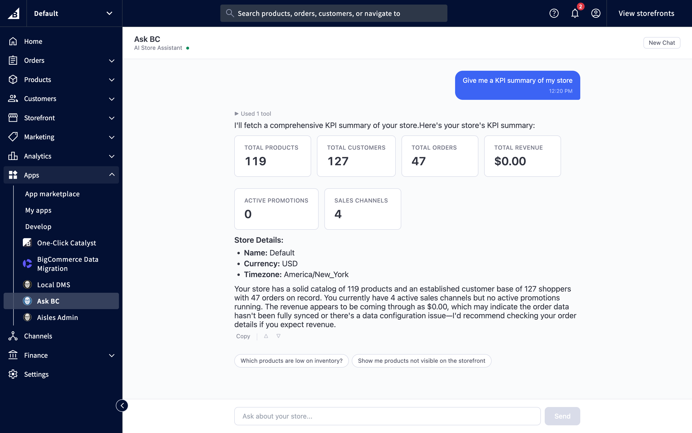

# Ask BC

AI store assistant for BigCommerce merchants. Ask about orders, products, and customers, and get answers rendered as live UI instead of plain text. Write operations preview before they execute — no blind writes.

[](LICENSE)
[](https://nextjs.org)
[](https://workers.cloudflare.com)
[](https://www.bigcommerce.com)



*Demo store data — 119 products, 127 customers, seeded via [gen-commerce-store-data](https://github.com/nino-chavez/gen-commerce-store-data), not a real merchant.*

This implementation targets BigCommerce as the integration surface — see [Tech Stack](#tech-stack) for the full architecture.

## Contents

- [Features](#features)
- [Tech Stack](#tech-stack)
- [Architecture](#architecture)
- [Quick Start](#quick-start)
- [Deploy](#deploy)
- [BC App Setup](#bc-app-setup)
- [License](#license)

## Features

- **Chat with your store data** — ask about orders, products, customers, promotions
- **29 BC API tools** — 22 read tools + 7 write tools against real BC REST APIs
- **Generative UI** — 7 React block components rendered inline in the chat (KPICard, DataTable, ProductCard, OrderTimeline, InventoryBar, SparklineChart, ErrorCard)
- **Write operations** — create coupons, update inventory, toggle visibility, update pricing — with a two-turn confirmation pattern before any mutation
- **App Extension panels** — contextual "Ask BC" on Orders and Products pages
- **Chat history** — persists across sessions via IndexedDB
- **BC help docs** — answers "how do I..." questions with links
- **Context-aware** — knows what order/product you're viewing

## Tech Stack

| Layer | Technology |
|-------|-----------|
| UI Framework | Next.js 15 (App Router) on Vercel |
| Agent Runtime | Cloudflare Worker — @cloudflare/think (Project Think) + @cloudflare/codemode |
| AI Models | Claude Haiku 4.5 (default) + Claude Sonnet 4.6 (continuation turns) via @ai-sdk/anthropic |
| Chat Protocol | WebSocket via useAgent/useAgentChat (agents/react) — browser connects directly to Worker |
| Session Persistence | Durable Object per store with SQLite (write audit log) |
| UI Components | BigDesign UI + Tailwind CSS (tw- prefix) |
| Credentials | Upstash Redis (AES-256-GCM encrypted tokens, shared between Vercel and Worker) |
| Chat History | IndexedDB (browser-side) |
| Auth | BigCommerce OAuth 2.0 → JWT sessions (jose) |

## Architecture

Ask BC is a hybrid: the Next.js app on Vercel handles OAuth, the BC admin iframe shell, and App Extensions. The agent runtime runs in a Cloudflare Worker using Project Think as the base class. The browser connects directly to the Worker via WebSocket — there is no Vercel proxy in the chat path.

The Worker runs a Durable Object per store (`AskBC extends Think`). On each chat turn:
1. The Worker resolves per-store credentials from Upstash Redis
2. Read tools execute inside a Codemode sandbox — the model writes TypeScript that chains BC API calls, and Codemode executes it in a Dynamic Worker
3. Write tools run outside the sandbox with a two-turn confirmation gate (preview then execute)
4. The model emits `block`-fenced JSON that the Next.js client parses and renders as inline React components

For detailed architecture docs and diagrams, see [docs/architecture/README.md](docs/architecture/README.md).

## Quick Start

### 1. Clone and install

```bash
git clone https://github.com/nino-chavez/ask-bc.git
cd ask-bc
npm install
```

### 2. Configure the Next.js app

```bash
cp .env.local.example .env.local
# Fill in your credentials — see docs/developer/README.md for the full variable table
```

### 3. Configure the Worker

```bash
cd workers/agent-runtime
npm install
cp .dev.vars.example .dev.vars
# Fill in: ANTHROPIC_API_KEY, UPSTASH_REDIS_REST_URL, UPSTASH_REDIS_REST_TOKEN,
#          CREDENTIAL_ENCRYPTION_KEY, JWT_KEY
```

### 4. Run both servers (separate terminals)

```bash
# Terminal 1 — Next.js
npm run dev

# Terminal 2 — Worker
cd workers/agent-runtime && npx wrangler dev
```

### 5. Open the dev session

```
http://localhost:3000/dev/session/dev-store
```

See [docs/developer/README.md](docs/developer/README.md) for full setup, environment variables, and troubleshooting.

## Deploy

**Vercel (Next.js app)** — auto-deploys on GitHub push to `main`. Set the 12 env vars listed in [docs/ops/deployment.md](docs/ops/deployment.md).

**Cloudflare Worker** — manual deploy:

```bash
cd workers/agent-runtime
npx wrangler deploy
```

Set the 5 Worker secrets via `wrangler secret put`. See [docs/ops/deployment.md](docs/ops/deployment.md) for the full deployment procedure.

**Live deployments:**
- App: <https://askbc.ninochavez.co>
- Worker: <https://ask-bc-agent-runtime.biq.workers.dev>

## BC App Setup

After deploying, configure your app in the [BC Developer Portal](https://devtools.bigcommerce.com/my/apps):

| Callback | URL |
|----------|-----|
| Auth | `https://your-vercel-domain.vercel.app/api/auth` |
| Load | `https://your-vercel-domain.vercel.app/api/load` |
| Uninstall | `https://your-vercel-domain.vercel.app/api/uninstall` |
| Remove User | `https://your-vercel-domain.vercel.app/api/remove-user` |

## License

MIT — see [LICENSE](LICENSE).
