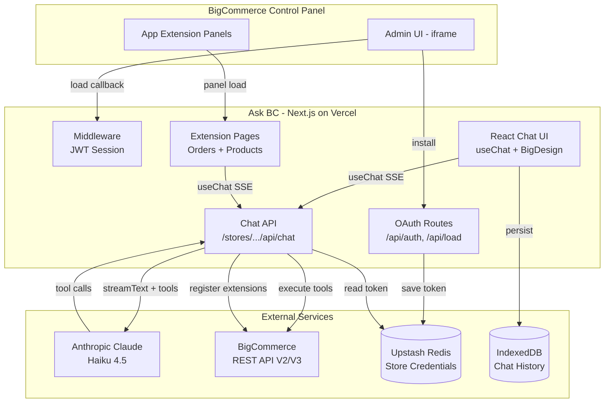
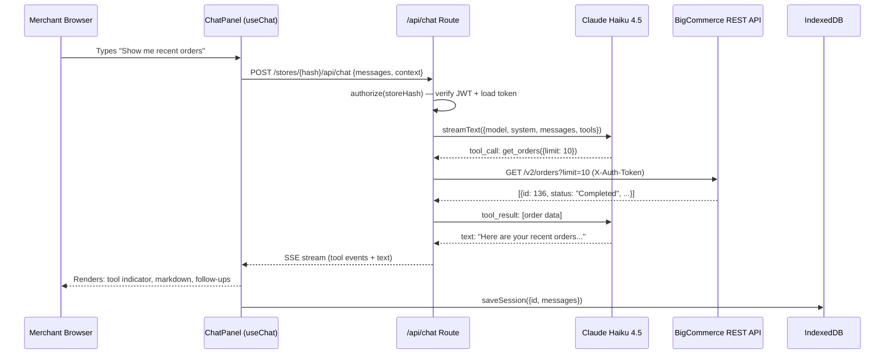
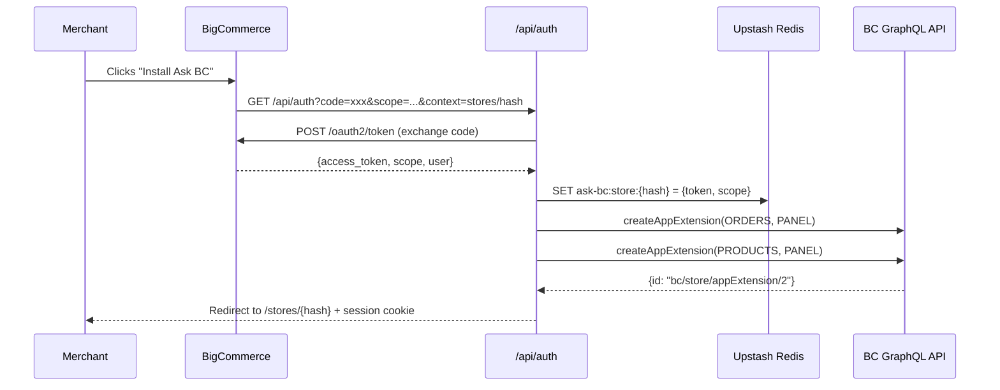

# Architecture Overview

> Auto-generated by Autonomous Knowledge Synthesis
> Last updated: 2026-04-07

## System Metaphor

Ask BC is an AI-powered concierge embedded directly in the BigCommerce admin control panel. Merchants interact with a chat interface that queries their real store data through BigCommerce REST APIs using Claude as the reasoning engine. The system operates as a single-click marketplace app that authenticates via OAuth, renders inside the admin iframe, and extends into contextual side panels on Orders and Products pages through BigCommerce App Extensions.

## Architectural Style

**Primary Pattern:** Next.js API Routes with Vercel AI SDK Streaming

The architecture follows a thin-server pattern where Next.js API routes serve as the orchestration layer between the browser-based chat UI and the external AI/BC APIs. Business logic concentrates in two areas: the AI tool layer (which maps Claude tool calls to BC REST API requests) and the authentication layer (which manages the OAuth-to-JWT session flow required for iframe embedding). The choice of Next.js App Router enables co-located client components and server-side API routes with zero additional infrastructure.

## High-Level Structure

## Component Catalog

| Directory | Responsibility | Key Files | Dependencies |
|-----------|---------------|-----------|--------------|
| `src/middleware.ts` | Intercept BC load callback, verify JWT, create session cookie, route App Extension loads | Single file (91 lines) | `jose` |
| `src/app/api/auth/` | OAuth install callback: exchange code for token, save to Redis, register App Extensions | `route.ts` (70 lines) | `auth.ts`, `store-credentials.ts`, `app-extensions.ts` |
| `src/app/api/uninstall/` | Uninstall callback: delete store credentials from Redis | `route.ts` (28 lines) | `auth.ts`, `store-credentials.ts` |
| `src/app/stores/[storeHash]/api/chat/` | Streaming chat endpoint: validate auth, build context-aware prompt, run Claude with BC tools | `route.ts` (73 lines) | `ai` SDK, `tools.ts`, `system-prompt.ts`, `models.ts` |
| `src/app/stores/[storeHash]/extensions/` | App Extension panel pages for Orders and Products with entity context | `orders/[id]/page.tsx`, `products/[id]/page.tsx` | `ChatPage` |
| `src/components/chat/` | Full chat UI: message list, markdown rendering, tool indicators, follow-ups, copy/feedback, history sidebar | `ChatPage`, `ChatPanel`, `MessageBubble`, `MessageList`, `ChatInput`, `ChatMarkdown` (1,191 lines total) | BigDesign, `@ai-sdk/react`, `chat-storage.ts` |
| `src/lib/ai/` | AI orchestration: system prompt builder, 15 tool definitions, model config, doc search | `tools.ts` (206), `system-prompt.ts` (58), `doc-search.ts` (131), `models.ts` (12) | `@ai-sdk/anthropic`, `zod`, `client.ts` |
| `src/lib/bigcommerce/` | BC integration: OAuth + JWT auth, REST API client (V2+V3), App Extensions GraphQL | `auth.ts` (142), `client.ts` (56), `app-extensions.ts` (191) | `jose`, `env.ts`, `redis.ts` |
| `src/lib/` | Shared infrastructure: Redis client, credential persistence, IndexedDB chat storage, env validation | `redis.ts`, `store-credentials.ts`, `chat-storage.ts`, `env.ts` | `@upstash/redis`, `@t3-oss/env-nextjs`, `zod` |

## Key Architectural Decisions

### Decision 1: Vercel AI SDK over Raw Anthropic SDK

- **Context:** The app requires a streaming chat interface with multi-turn tool use. The initial implementation used the raw `@anthropic-ai/sdk` with custom NDJSON streaming and a hand-written agent loop.
- **Decision:** Replaced with Vercel AI SDK v6 (`ai` + `@ai-sdk/anthropic` + `@ai-sdk/react`), providing `streamText()` with built-in tool loop via `stopWhen: stepCountIs(n)`, `useChat()` for client state, and `toUIMessageStreamResponse()` for streaming.
- **Alternatives Considered:** Raw Anthropic SDK (more control, more code), LangChain (heavier abstraction than needed).
- **Evidence:** `src/app/stores/[storeHash]/api/chat/route.ts` uses `streamText()` with `tools` and `stopWhen`; `src/components/chat/ChatPanel.tsx` uses `useChat()` hook.
- **Consequences:** Reduced agent loop from ~100 lines to ~15 lines. Tool definitions use Zod schemas. Trade-off: tied to AI SDK message format for serialization.

### Decision 2: IndexedDB for Chat Persistence over Server-Side Database

- **Context:** Chat history needs to persist across page reloads. The initial scaffold used Supabase PostgreSQL but was removed for simplicity.
- **Decision:** Chat sessions stored in IndexedDB via `src/lib/chat-storage.ts`. Messages serialized to a simplified format that strips non-serializable AI SDK internals.
- **Alternatives Considered:** Supabase (adds infrastructure), Upstash Redis (per-message writes), localStorage (size limits).
- **Evidence:** `src/lib/chat-storage.ts` implements full CRUD with IndexedDB. `src/components/chat/ChatPanel.tsx` auto-saves after each completed response.
- **Consequences:** Zero server infrastructure for chat. Per-browser persistence (not cross-device). Requires serialize/deserialize layer for AI SDK `UIMessage` format.

### Decision 3: Upstash Redis with File Fallback for Credentials

- **Context:** OAuth tokens must persist. Vercel has a read-only filesystem in production.
- **Decision:** Production uses Upstash Redis (Vercel KV). Local dev falls back to in-memory Map plus `.credentials.json` file.
- **Alternatives Considered:** Supabase (overkill for key-value), Vercel Edge Config (not for per-store secrets).
- **Evidence:** `src/lib/store-credentials.ts` implements dual storage. `src/lib/redis.ts` provides lazy singleton with graceful null.
- **Consequences:** Zero database infrastructure. Dev works without Redis. Trade-off: no migration path for credential format changes.

### Decision 4: BigDesign UI with Tailwind tw- Prefix

- **Context:** App renders inside BC admin iframe. UI must feel native.
- **Decision:** BigDesign for all components/icons. Tailwind with `tw-` prefix for custom layout. styled-components SSR via registry.
- **Alternatives Considered:** Tailwind-only (doesn't match BC admin), shadcn/ui (not BC-native).
- **Evidence:** `tailwind.config.ts` sets `prefix: 'tw-'`. `next.config.mjs` enables `transpilePackages` for BigDesign.
- **Consequences:** Native BC admin look. Trade-off: two styling systems require prefix discipline.

## Data Flow: Chat Message with Tool Use

## Data Flow: OAuth Install + App Extension Registration

## External Integrations

| Integration | Purpose | Location | Configuration |
|-------------|---------|----------|---------------|
| Anthropic Claude API | LLM reasoning and tool orchestration | `src/lib/ai/models.ts` | `ANTHROPIC_API_KEY` |
| BigCommerce REST V3 | Products, customers, categories, promotions, channels, tax, inventory | `src/lib/bigcommerce/client.ts` `.get()` | OAuth `access_token` |
| BigCommerce REST V2 | Store info, orders, coupons, shipping zones | `src/lib/bigcommerce/client.ts` `.getV2()` | Same token |
| BigCommerce GraphQL | App Extension registration | `src/lib/bigcommerce/app-extensions.ts` | Same token |
| BigCommerce OAuth | App installation and token exchange | `src/lib/bigcommerce/auth.ts` | `BIGCOMMERCE_CLIENT_ID`, `BIGCOMMERCE_CLIENT_SECRET` |
| BigCommerce JS SDK | Iframe session sync and logout | `src/components/BigCommerceSDK.tsx` | CDN script |
| Upstash Redis | Store credential persistence | `src/lib/redis.ts` | `KV_REST_API_URL`, `KV_REST_API_TOKEN` |

## Cross-Cutting Concerns

### Authentication and Authorization

Two-layer auth model:

1. **BigCommerce OAuth 2.0** — Install callback exchanges temporary code for permanent access token stored in Redis.
2. **Internal JWT Sessions** — Load callback verifies BC's `signed_payload_jwt`, creates internal JWT (24h expiry), sets as partitioned HttpOnly SameSite=none cookie scoped to `/stores/{storeHash}`.
3. **Route Protection** — `authorize(storeHash)` reads session cookie, verifies JWT, retrieves access token from Redis.

### Error Handling

Tool execution errors returned to Claude as `is_error: true` tool results (AI SDK handles automatically). System prompt instructs Claude to explain failures and suggest manual alternatives. Auth failures return 401; invalid input returns 400. Streaming errors close the stream gracefully.

### Configuration Management

Environment variables validated at startup via `@t3-oss/env-nextjs` with Zod schemas (`src/lib/env.ts`). Build-time validation skipped on Vercel via `SKIP_ENV_VALIDATION=1`. BC API URLs default to production but are overridable.

### Streaming

`streamText()` returns an `AIStream` consumed by `useChat()` hook via SSE. Tool calls executed server-side in the streaming loop; client receives interleaved tool and text events.

## Technical Constraints

- **Iframe embedding** — HTTPS required. CSP `frame-ancestors` allows `*.bigcommerce.com`. Cookies must be `SameSite=none`, `Secure`, `Partitioned`.
- **Read-only Vercel filesystem** — Redis required for production credential storage.
- **OAuth scope limitations** — Adding new API scopes requires merchant reinstall.
- **App Extension limits** — Max 2 extensions per model per app. Requires `store_app_extensions_manage` scope.
- **AI SDK message serialization** — `UIMessage` objects require serialize/deserialize layer for IndexedDB persistence.

## Areas of Complexity

| Area | Complexity Indicator | Risk Level |
|------|---------------------|------------|
| `MessageBubble.tsx` (360 lines) | Tool states, markdown, copy/feedback, follow-ups in single component | Medium |
| `auth.ts` (142 lines) | Multi-step auth spanning OAuth, JWT, cookies, Redis with dev fallback | Medium |
| `app-extensions.ts` (191 lines) | GraphQL mutations with required fields; scope-dependent | Medium |
| `middleware.ts` (91 lines) | Must detect extension vs normal loads; Edge Runtime constraints | Low |
| `chat-storage.ts` (152 lines) | IndexedDB + serialize/deserialize for AI SDK messages | Low |

---

## Related Documentation

- [Developer Setup](../developer/README.md)
- [Infrastructure](../ops/infrastructure.md)
- [ADR Index](./decisions/README.md)
