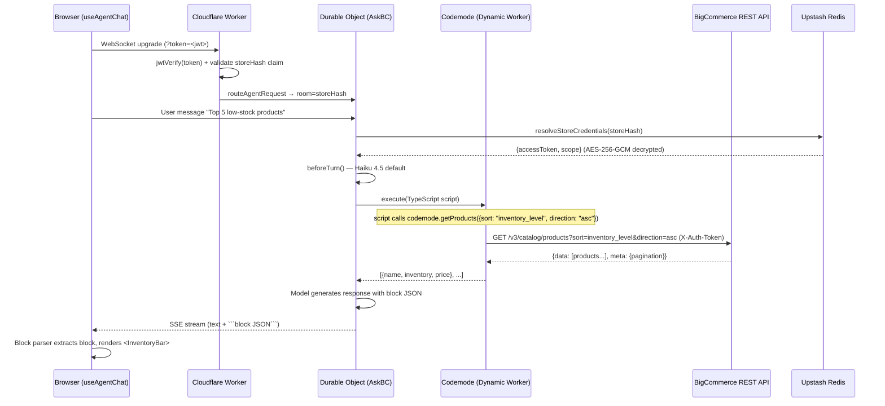
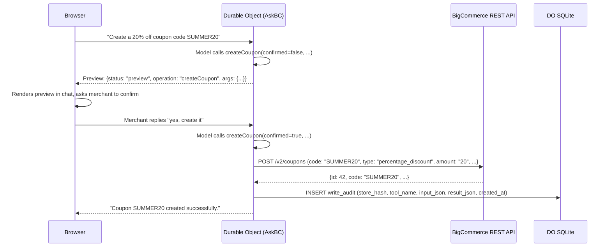
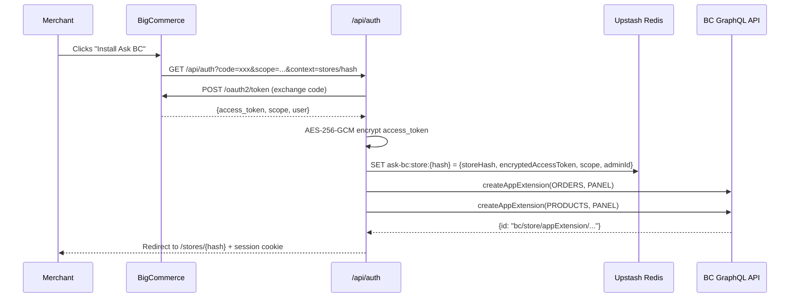

# Architecture Overview

> Last updated: 2026-04-15

## Architectural Direction

Ask BC is a **hybrid architecture**: the agent runtime runs on a Cloudflare Worker using Project Think + Codemode, while the Next.js app on Vercel continues to handle OAuth, the BC admin iframe shell, App Extensions, and the chat UI. The browser connects directly to the Worker via WebSocket — Vercel is not in the chat request path.

Related references:
- [ADR-001: Codemode Agent Runtime on Cloudflare](./decisions/001-codemode-agent-runtime.md) — architectural decision, gap analysis, alternatives, consequences
- [Developer guide: `workers/agent-runtime/`](../developer/agent-runtime.md) — operational reference, running locally, known gotchas, phase history

## System Metaphor

Ask BC is an AI-powered concierge embedded directly in the BigCommerce admin control panel. Merchants interact with a chat interface that queries and mutates their real store data through BigCommerce REST APIs, with Claude as the reasoning engine. The system operates as a single-click marketplace app that authenticates via OAuth, renders inside the admin iframe, and extends into contextual side panels on Orders and Products pages through BigCommerce App Extensions.

## High-Level Structure

```mermaid
graph TB
    subgraph "BigCommerce Control Panel"
        CP[Admin UI - iframe]
        EXT[App Extension Panels<br/>Orders + Products]
    end

    subgraph "Ask BC — Next.js on Vercel"
        MW[Middleware<br/>JWT Session]
        AUTH[OAuth Routes<br/>/api/auth, /api/load]
        UI[WorkerChatPanel<br/>useAgentChat + BigDesign]
        EXT_PAGES[Extension Pages<br/>Orders + Products]
        BLOCKS[Block Renderer<br/>7 React Components]
    end

    subgraph "Ask BC — Cloudflare Worker"
        WS[WebSocket Upgrade<br/>JWT Auth Gate]
        DO[Durable Object<br/>AskBC per store]
        CM[Codemode Sandbox<br/>Dynamic Worker]
        AUDIT[Write Audit Log<br/>DO SQLite]
    end

    subgraph "External Services"
        CLAUDE_H[Claude Haiku 4.5<br/>default turns]
        CLAUDE_S[Claude Sonnet 4.6<br/>continuation turns]
        BCAPI[BigCommerce<br/>REST API V2/V3]
        REDIS[(Upstash Redis<br/>Encrypted Credentials)]
        IDB[(IndexedDB<br/>Chat History)]
    end

    CP -->|load callback| MW
    CP -->|install| AUTH
    EXT -->|panel load| EXT_PAGES
    UI -->|WebSocket + JWT| WS
    EXT_PAGES -->|WebSocket + JWT| WS
    WS -->|validate storeHash| DO
    DO -->|getModel()| CLAUDE_H
    DO -->|beforeTurn(continuation)| CLAUDE_S
    DO -->|createExecuteTool| CM
    CM -->|codemode.* RPC| BCAPI
    DO -->|write tools| BCAPI
    DO -->|logWrite| AUDIT
    AUTH -->|save encrypted token| REDIS
    DO -->|resolveStoreCredentials| REDIS
    UI -->|block JSON| BLOCKS
    UI -->|persist| IDB
```

## Worker Data Flow: Chat Turn with Codemode



## Worker Data Flow: Write Operation (Two-Turn)



## Vercel-Side Data Flow: OAuth Install + App Extension Registration



## Component Catalog

| Directory | Responsibility | Key Files |
|-----------|---------------|-----------|
| `workers/agent-runtime/src/index.ts` | AskBC Think class, all tools, system prompt, CORS, JWT auth gate | Single file (~1050 lines) |
| `workers/agent-runtime/src/bc/client.ts` | Typed BC API client factory — V2 empty-body middleware, 401/403 detection | `createBcClients()` |
| `workers/agent-runtime/src/credentials.ts` | Per-store credential resolution from Redis with AES-256-GCM decrypt | `resolveStoreCredentials()` |
| `workers/agent-runtime/src/blocks.ts` | Block schema catalog + system prompt renderer — shared source of truth | `BLOCK_SCHEMAS`, `renderBlockCatalog()` |
| `src/middleware.ts` | Intercept BC load callback, verify JWT, create session cookie | `jose` |
| `src/app/api/auth/` | OAuth install: exchange code → encrypt token → Redis → register App Extensions | `auth.ts`, `store-credentials.ts`, `app-extensions.ts` |
| `src/app/stores/[storeHash]/` | Store-scoped pages — main chat + App Extension panels | `WorkerChatPanel` |
| `src/components/chat/blocks/` | 7 generative UI block components + parser + registry | BigDesign + Recharts |
| `src/lib/store-credentials.ts` | Vercel-side AES-256-GCM credential storage (Redis + file fallback) | `setStoreCredentials()`, `getStoreCredentials()` |

## Key Architectural Decisions

### Decision 1: Cloudflare Worker + Project Think over Vercel AI SDK Tool Loop

- **Context:** The Vercel AI SDK tool loop (`streamText()` with `stopWhen`) has a 10-second Vercel function timeout constraint and runs all tools server-side in the same Node.js process.
- **Decision:** Agent runtime moved to a Cloudflare Worker using `@cloudflare/think` (Project Think) as the `Think` base class. Codemode executes tool scripts in isolated Dynamic Workers. Durable Objects provide per-store session persistence.
- **Consequences:** No function timeout constraint; Codemode can run multi-step scripts with Promise.all and joins in a single sandbox execution; per-store DO provides conversation memory without a database; write tools can be structurally excluded from the sandbox.

### Decision 2: Codemode Sandbox for Read Operations

- **Context:** The original tool loop made one BC API call per tool call, requiring multiple round-trips for compound questions ("which customers placed the most orders last month").
- **Decision:** Read tools run inside a Codemode sandbox. The model writes a TypeScript script using `codemode.*` proxy functions, Codemode executes it in a Dynamic Worker, and returns the aggregated result. Credentials are injected by the host and never appear in generated scripts.
- **Consequences:** The model can chain reads with `Promise.all`, join across APIs in memory, and paginate — all in a single sandbox execution. Generated code errors are handled by the model retrying with a different approach (triggering Sonnet upgrade via `continuation: true`).

### Decision 3: Write Tools Outside the Sandbox

- **Context:** Codemode gives the model arbitrary code execution within the sandbox. Write operations must not be reachable from arbitrary code.
- **Decision:** Write tools are registered as top-level AI SDK tools, not inside `createExecuteTool()`. The Codemode sandbox only sees read tools. Write tools enforce a `confirmed: boolean` two-turn pattern at the tool implementation level.
- **Consequences:** Structural isolation of reads from writes. The model can only write by making explicit top-level tool calls that flow through the approval gate. Even if a Codemode script attempted `codemode.createCoupon()`, the function would not exist in the sandbox.

### Decision 4: AES-256-GCM Credential Encryption at Rest

- **Context:** BC access tokens stored in Redis are long-lived and grant broad API access. Redis at-rest encryption varies by tier.
- **Decision:** Vercel app encrypts tokens with AES-256-GCM before writing to Redis. Worker decrypts on read. 256-bit key (`CREDENTIAL_ENCRYPTION_KEY`) shared between both services via their respective secret stores.
- **Consequences:** Tokens are useless without the encryption key even if Redis is compromised. Key rotation requires re-encrypting all stored tokens — handled by reinstalling the app (which triggers a new OAuth flow and write).

### Decision 5: IndexedDB for Chat Persistence

- **Context:** Chat history needs to persist across page reloads. The Durable Object holds session state for the active connection but is ephemeral across page loads.
- **Decision:** Chat sessions stored in IndexedDB via `src/lib/chat-storage.ts`. Messages serialized to strip non-serializable AI SDK internals before storage.
- **Consequences:** Zero server infrastructure for chat history. Per-browser, not cross-device. Requires a serialize/deserialize layer for AI SDK `UIMessage` format.

### Decision 6: BigDesign UI with Tailwind tw- Prefix

- **Context:** App renders inside BC admin iframe. UI must feel native.
- **Decision:** BigDesign for all components and icons. Tailwind with `tw-` prefix for custom layout and spacing. styled-components SSR via registry for BigDesign.
- **Consequences:** Native BC admin look and feel. Two styling systems coexist without conflicts via prefix isolation.

## External Integrations

| Integration | Purpose | Configuration |
|-------------|---------|---------------|
| Anthropic Claude Haiku 4.5 | Default LLM for all turns | `ANTHROPIC_API_KEY` |
| Anthropic Claude Sonnet 4.6 | LLM for continuation/retry turns | Same key |
| BigCommerce REST V3 | Products, customers, categories, promotions, channels, inventory | OAuth access_token (per store) |
| BigCommerce REST V2 | Orders, coupons | Same token |
| BigCommerce GraphQL | App Extension registration | Same token |
| BigCommerce OAuth | App installation and token exchange | `BIGCOMMERCE_CLIENT_ID`, `BIGCOMMERCE_CLIENT_SECRET` |
| BigCommerce JS SDK | Iframe session sync and logout | CDN script |
| Upstash Redis | Encrypted credential storage (shared Vercel + Worker) | `KV_REST_API_URL`/`UPSTASH_REDIS_REST_URL` + tokens |

## Cross-Cutting Concerns

### Authentication and Authorization

Three-layer model:

1. **BigCommerce OAuth 2.0** — Install callback exchanges code for access token. Token AES-256-GCM encrypted before Redis storage.
2. **Internal JWT Sessions** — Load callback verifies BC's `signed_payload_jwt`, creates internal JWT (24h expiry) with `{storeHash}` claim. Set as partitioned HttpOnly SameSite=none cookie.
3. **Worker JWT Gate** — `WorkerChatPanel` mints a short-lived JWT via `getAgentToken()`. Passed as `?token=<jwt>` on WebSocket upgrade. Worker verifies signature and validates that `payload.storeHash` matches the DO room name.

### Generative UI Block Protocol

The agent emits structured data as fenced code blocks with language `block` containing JSON: `{"type": "ComponentName", "props": {...}}`. The Next.js client's markdown renderer detects these fences, parses the JSON, looks up the component in the block registry, and mounts the React component inline. The block schema catalog in `workers/agent-runtime/src/blocks.ts` is the single source of truth for component names, prop shapes, and usage guidance injected into the system prompt.

### Error Handling

Codemode script errors surface as tool errors. The AI SDK marks them as `is_error: true` and `beforeTurn` upgrades to Sonnet 4.6 (`continuation: true`) for the retry. If Sonnet also fails, the model explains the failure to the merchant and suggests manual alternatives. BC 401/403 errors are detected by middleware in `bc/client.ts` and returned as structured errors. Streaming errors close the WebSocket gracefully.

### Technical Constraints

- **Iframe embedding** — HTTPS required. CSP `frame-ancestors` allows `*.bigcommerce.com`. Cookies must be `SameSite=none`, `Secure`, `Partitioned`.
- **Codemode timeout** — 30-second timeout on sandbox execution (`timeout: 30_000` in `createExecuteTool`).
- **DO SQLite** — Write audit log lives in the Durable Object's SQLite storage. Data is per-DO, not queryable across stores without a separate pipeline.
- **OAuth scope limitations** — Adding new API scopes requires merchant reinstall.
- **App Extension limits** — Max 2 extensions per model per app. Requires `store_app_extensions_manage` scope.
- **CORS** — Worker CORS is restricted to `APP_ORIGIN`. If `APP_ORIGIN` is wrong, the browser WebSocket connection will fail with a CORS error.

---

## Related Documentation

- [Developer Setup](../developer/README.md)
- [Agent Runtime Operational Reference](../developer/agent-runtime.md)
- [Infrastructure](../ops/infrastructure.md)
- [Deployment](../ops/deployment.md)
- [ADR Index](./decisions/README.md)
